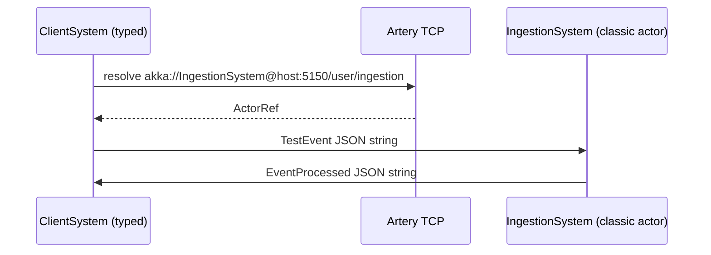

# Migration guide: previous layout vs current

This document explains what changed when the repo was restructured from two standalone sbt projects into a root-level multi-module monorepo on Scala 3.

## At a glance

| Topic | Previous version | Current version |
|--------|------------------|-----------------|
| **Scala** | 2.12.3 | 3.4.2 |
| **Akka** | 2.5.4 classic actors | 2.8.8 (Typed client + classic endpoint handler) |
| **Remoting** | Netty TCP (`akka.remote.netty.tcp`) | Artery TCP (`akka.remote.artery`) |
| **Actor URLs** | `akka.tcp://IngestionSystem@host:port/user/ingestion` | `akka://IngestionSystem@host:port/user/ingestion` |
| **Payloads** | Hand-built JSON strings | Circe `TestEvent` / `EventProcessed` in `ingestion-api` |
| **Shared code** | Duplicated deps and HOCON in both apps | `ingestion-api` + `ingestion-common` modules |

---

## How the distributed flow works now

The high-level flow is the same as before (client resolves remote actor, sends JSON string, endpoint replies), but wiring and formats are stricter.



### Endpoint (server)

| Previous | Current |
|----------|---------|
| `IngestionActor` classic actor, `main` in same object | `EndpointApp` starts typed guardian; spawns `IngestionClassicActor` named `ingestion` |

Entry point: `com.ingestion.endpoint.EndpointApp`

### Client

| Previous | Current |
|----------|---------|
| `IngestionClientActor` sent one hard-coded payload in `preStart` | `ClientBehavior` resolves endpoint, then sends `TestEvent` via Circe |
| Actor selection in actor body | Selection + `resolveOne()` with 5s timeout; logs failure |
| Port **0** (ephemeral) | Still ephemeral via `application.conf` |
| No CLI overrides | `--host` / `--port` or `ingestion.endpoint.*` in config |

Entry point: `com.ingestion.client.ClientApp`

The client is **Akka Typed**; it talks to the **classic** remote actor using `messageAdapter` and `replyTo.toClassic` so replies route back correctly.

---

## Configuration changes

### Previous (per app, full copy)

**Endpoint** (`ingestion-endpoint.akka/.../application.conf`):

```hocon
akka.remote.enabled-transports = ["akka.remote.netty.tcp"]
akka.remote.netty.tcp { hostname = "127.0.0.1", port = 5150 }
akka.actor.provider = "akka.remote.RemoteActorRefProvider"
```

**Client**: same transport, `port = 0`.

### Current (layered HOCON)

**Shared** — `modules/ingestion-common/src/main/resources/application-base.conf`:

- Artery TCP, canonical hostname `127.0.0.1`
- SLF4J logging

**Endpoint** — includes base + sets `akka.remote.artery.canonical.port = 5150`

**Client** — includes base + `canonical.port = 0` and optional `ingestion.endpoint.host` / `ingestion.endpoint.port`

Config is merged on the classpath from module dependencies (no file-path loading).

---

### Classpath / config pitfalls (fixed)

| Issue | Previous behavior | Current behavior |
|-------|-------------------|----------------|
| Config in fat JAR | `getResource(...).getFile` breaks inside JARs | `ConfigFactory.load` uses classpath stream |
| Duplicate Akka config | Two unrelated `application.conf` trees | Shared `application-base.conf` + small overrides |
| Version drift | Endpoint and client could diverge | `project/Dependencies.scala` pins one Akka version |

## Further reading

- [README](../README.md) — quick start and module table
- [Akka Artery remoting](https://doc.akka.io/docs/akka/current/remoting-artery.html)
- [Akka Typed](https://doc.akka.io/docs/akka/current/typed/index.html)
